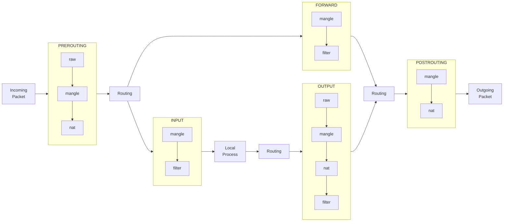

# bumpなsquidを作るDockerfile
httpsもキャッシュしてくれるといいなと思いがんばってみた

# 使い方
```
mkdir squid-b && cd squid-b
curl --compressed -O https://raw.githubusercontent.com/oxxpeh/pub/main/docker/squid/Dockerfile
curl --compressed -O https://raw.githubusercontent.com/oxxpeh/pub/main/docker/squid/squid.conf
docker build -t squid-b-img .
# -- proxy必要なら 「--build-arg HTTP_PROXY=http://192.168.1.1:3128」とか
# -- 「docker.io」だけではなく「docker-buildx」もaptでinstallしておく
docker run -d -p 3128:3128 --name sq-b --hostname sq-b squid-b-img
docker cp sq-b:/etc/squid/squid-b.crt .
# -- squidで作成する証明書の発行機関の証明書をコピー
# -- windwosでいうところの「信頼されたルート証明機関」にコピー
```

# その他
## キャッシュディレクトリ
`cache_dir ufs /srv/squid/cache 10000 16 256` 「10000MB」に指定<BR>
サイズ変更は「build」前にしたほうが良いかも
## squidclient
「purge」もできる予定
## ubuntuでの「信頼されたルート証明機関」にコピー
```
sudo mkdir -p /usr/share/ca-certificates/oreore
sudo cp squid-b.crt /usr/share/ca-certificates/oreore/
sudo bash -c "echo 'oreore/squid-b.crt' >> /etc/ca-certificates.conf"
sudo update-ca-certificates
# -- 削除は以下
sudo bash -c "echo '!oreore/squid-b.crt' >> /etc/ca-certificates.conf'
sudo update-ca-certificates
```
「curl」や「git」は以下のおまじないでいけるはず<BR>
`export HTTP_PROXY=http://172.16.31.28:3128`<BR>
`export HTTPS_PROXY=http://172.16.31.28:3128`<BR>
「172.16.31.28」はdockerホストのIPに
## service squid stop
「/run/squid.pid」ファイルが残るようで<BR>
`shutdown_lifetime 1 seconds`設定したらファイルは消えるけどなんか駄目<BR>
`alias kill-sq='kill $( pgrep squid )'`で停止コマンド設定<BR>
イメージ作成中`service squid start`は使えてた
## 透過型
ポート「3129」に透過proxy、ポート「3130」に通常proxy<BR>
コメント外してbuildし直すか、nat追加などで動作する予定<BR>
透過の場合は宛先nat設定も必要<BR>
以下はdockerコンテナに対しての宛先nat設定「172.17.0.2」はsquid dcokerのIP
```
sudo iptables -S -t nat -A PREROUTING -s 172.17.0.2/32 -i docker0 -j ACCEPT
sudo iptables -S -t nat -A PREROUTING -i docker0 -p tcp -m tcp --dport 443 -j DNAT --to-destination 172.17.0.2:3129
sudo iptables -S -t nat -A PREROUTING -i docker0 -p tcp -m tcp --dport 80 -j DNAT --to-destination 172.17.0.2:3129
```
## iptablesおまけ

