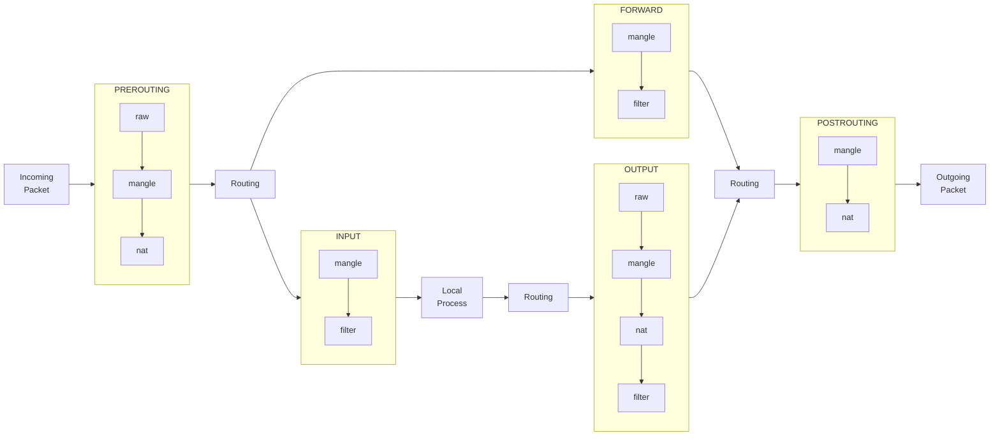

# bumpなsquidを作るDockerfile
httpsもキャッシュしてくれるといいなと思いがんばってみた

# 使い方
```
mkdir squid-b && cd squid-b
curl --compressed -O https://raw.githubusercontent.com/oxxpeh/pub/main/docker/squid/Dockerfile
curl --compressed -O https://raw.githubusercontent.com/oxxpeh/pub/main/docker/squid/squid.conf
docker build -t squid-b-img .
# -- proxy必要なら 「--build-arg HTTP_PROXY=http://192.168.1.1:3128」とか
# -- 「docker.io」だけではなく「docker-buildx」もaptでinstallしておく
docker run -d -p 3128:3128 --name sq-b --hostname sq-b squid-b-img
docker cp sq-b:/etc/squid/squid-b.crt .
# -- squidで作成する証明書の発行機関の証明書をコピー
# -- windwosでいうところの「信頼されたルート証明機関」にコピーをしないとエラーが
```

# その他
## キャッシュディレクトリ
`cache_dir ufs /srv/squid/cache 10000 16 256` 「10000MB」に指定<BR>
サイズ変更は「build」前にしたほうが良いかも
## squidclient
「purge」もできる予定
## ubuntuでの「信頼されたルート証明機関」にコピー
```
sudo mkdir -p /usr/share/ca-certificates/oreore
sudo cp squid-b.crt /usr/share/ca-certificates/oreore/
sudo bash -c "echo 'oreore/squid-b.crt' >> /etc/ca-certificates.conf"
sudo update-ca-certificates
```
削除は以下
```
sudo bash -c "echo '!oreore/squid-b.crt' >> /etc/ca-certificates.conf'
sudo update-ca-certificates
```
「curl」や「git」は以下のおまじないでいけるはず<BR>
`export HTTP_PROXY=http://172.16.31.28:3128`<BR>
`export HTTPS_PROXY=http://172.16.31.28:3128`<BR>
「172.16.31.28」はdockerホストのIPに
## service squid stop
コンテナ異常停止したときにも「/run/squid.pid」が残ってコンテナ起動後にすぐ停止しちゃうので<BR>
`pid_filename none`に変更<BR>
「/run/squid.pid」ファイルが残るようで<BR>
`shutdown_lifetime 1 seconds`設定したらファイルは消えるけどなんか駄目<BR>
`alias kill-sq='kill $( pgrep squid )'`で停止コマンド設定<BR>
イメージ作成中`service squid start`は使えてた
## 透過型
(日本語が雑…)<BR>
ポート「3129」に透過proxy、ポート「3130」に通常proxy<BR>
コメント外して再起動とか、ポート追加して別途「run(-p 3129:3129 追加)」か<BR>
「nat追加(sudo iptables -A DOCKER ! -i docker0 -p tcp -m tcp --dport 3129 -j DNAT --to-destination 172.17.0.2:3129)」<BR>
などで動作する予定<BR>
透過の場合は宛先nat設定とかも必要かも<BR>
以下はdockerコンテナからの宛先nat設定例「172.17.0.2」はsquid コンテナのIP
dockerホストで設定
(「http」と「https」の宛先を変える)
```
sudo iptables -S -t nat -A PREROUTING -s 172.17.0.2/32 -i docker0 -j ACCEPT
sudo iptables -S -t nat -A PREROUTING -i docker0 -p tcp -m tcp --dport 443 -j DNAT --to-destination 172.17.0.2:3129
sudo iptables -S -t nat -A PREROUTING -i docker0 -p tcp -m tcp --dport 80 -j DNAT --to-destination 172.17.0.2:3129
```
## bumpとwindows update
証明書なんとか「0x800b0109」なエラーが出た。
squidのログは
```
1727515232.448     23 - TCP_DENIED/403 3632 GET http://www.microsoft.com/pki/certs/MicRooCerAut2011_2011_03_22.crt - HIER_NONE/- text/html
```
update関連をbumpさせない対策はキャッシュしなくなるので…  
Windowsの証明書では一部でOSなどに同梱(？)してるものをしてるものがあるようで  
証明書の取得に失敗してTLS Handshake失敗することがあるようで。  

<span style="color: #38761d;"><br>(参)<br>Squid透過プロキシでEdgeの更新が出来なくなったのを解消する #squid - Qiita<br>https://qiita.com/ripple_naip/items/903e33ed1d1f308a5818</span><br>

参照もとのようにMS関連コピーするのが良いのでしょうが、ログの出たものだけの対応を。
```
# squidコンテナ動作のホストで実施
curl -O http://www.microsoft.com/pki/certs/MicRooCerAut2011_2011_03_22.crt
docker cp MicRooCerAut2011_2011_03_22.crt sq-b:/tmp
# squid動作のコンテナで実施
mkdir /usr/share/ca-certificates/MS
cp /tmp/MicRooCerAut2011_2011_03_22.crt /usr/share/ca-certificates/MS
echo "MS/MicRooCerAut2011_2011_03_22.crt" >> /etc/ca-certificates.conf
update-ca-certificates
```
updateできるようになったけど以下のログは出てる…
```
1727515232.448     23 - TCP_DENIED/403 3632 GET http://www.microsoft.com/pki/certs/MicRooCerAut2011_2011_03_22.crt - HIER_NONE/- text/html
```
キャッシュしてないようで「squid.conf」に以下追加
```
refresh_pattern .exe$ 0 20% 1440 override-expire override-lastmod \
ignore-reload ignore-no-cache ignore-no-store ignore-private
```
設定数値はよくわかっていない…   
dockerファイルはそのうち修正予定…   
(curl ip less とかも追加したいな)

自動更新はプロキシの設定ではなくて「winhttp」の設定を見るもよう  
(他でも書かれてましたが winhttpなんて知らんかった)
<span style="color: #38761d;"><br>(参)<br>ブラウザのプロキシ設定を行い、手動でWindows Updateができるようになったのですが、自動更新が実行されません。自動更新が利用するプロキシの設定の仕方を教えてください。｜よくあるご質問｜法人向けクラウドサービスのbit-drive<br>https://faq2.bit-drive.ne.jp/support/traina-faq/result/21-2129?ds=&receptionId=1963044&receptionNum=1721304149539&page=1&inquiryWord=&categoryPath=148&selectedDataSourceId=&sort=_score&order=desc&attachedFile=false</span><br>
```
netsh winhttp set proxy 192.168.1.100:3172
rem 確認するなら以下のコマンド。
netsh winhttp show proxy
rem リセットするなら以下のコマンド。
rem netsh winhttp reset proxy
```

# 履歴
## 2024/09/28
windows update関連追記
## 2024/07
# iptablesおまけ
ちがってたらごめんなさい

