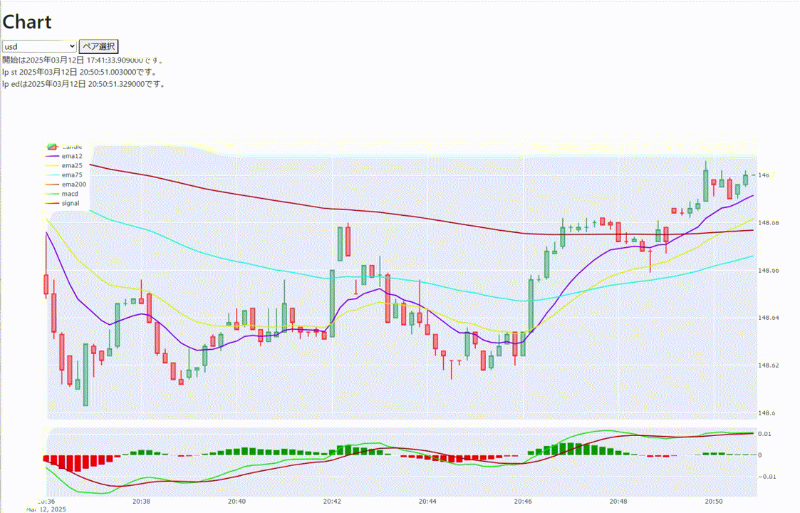

# PyScript plotlyで10秒足のローソク足チャート作成  
## 動作画面
以下なチャートが表示される予定
  
[githubpagesで動作ページ](https://oxxpeh.github.io/2025/03_pys_ch.html)  
上記ページの参照データ(ここにアップされてるgmo_sck_tck_BTC_JPY.pck)は更新されないので  
毎秒データ受信するがグラフの変化はなし  
「開始は2025年03月15日 19:20:07.326000です。」な表示が出たら準備完了(結構時間がかかる)  
## 補足
webサーバから価格情報を毎秒取得しローソク足などを描画する  
価格情報はwebサーバ側で業者提供の「Public WebSocket API」と接続し生成  
  
ファイルリスト  
・pys_ch.html ->ブラウザが要求するhtmlファイル  
・pys_ch.toml ->PyScriptの設定ファイル  
・pys_ch.py ->PyScriptとして実行してるPythonコード  
・gmo_sck_tck_BTC_JPY.pck ->価格情報データ  

 (参) PyScript https://pyscript.com/@examples 
 (参) Public WebSocket API – 暗号資産のAPIドキュメント| GMOコイン https://api.coin.z.com/docs/#public-ws-api 
## その他  
別スレッドで「Public WebSocket API」とやり取りするコード追加もできると思うけどわたしには…  
必要のない記述がたくさんありそう…  
2年前はreplの例があってデバッグがやりやすかったような  
panelについてもよくわかっていない…  
(PyScript 2025.2.4 では動作しなかったような)
httpサーバでは動作しなくてhttpsの設定が必要だった  
plotlyにて値が正負で色を変えれることを知った  
plotlでyhtml要素生成するのはダメだった、JSON変換などで動作してる模様  
毎秒更新してるのでplotlyで使える拡大縮小など使えない…  
