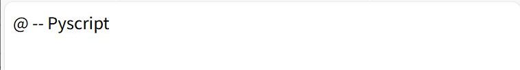

# PyScriptのメモいろいろ(ver 2025.3.1にて)
いろいろやってみて、html、CSS、DOM(?)のお試しとして使うのには良いと思いました
## 使い方
htmlに以下のように書く
```html
<head>
    <link rel="stylesheet" href="https://pyscript.net/releases/2025.3.1/core.css">
    <script type="module" src="https://pyscript.net/releases/2025.3.1/core.js"></script>
</head>
<body>
    <script type="py">
from pyscript.web import page as ii_pg
ii_pg.body.innerHTML =('@ -- Pyscript')
    </script>
</body>

```
<br />
「type」を「[py-editor」にすると  
<br />

いろいろ試した結果以下に
```html
<head>
    <link rel="stylesheet" href="https://pyscript.net/releases/2025.3.1/core.css">
    <script type="module" src="https://pyscript.net/releases/2025.3.1/core.js"></script>
    <script src="https://oxxpeh.pyscriptapps.com/editor-add/latest//pyeditor_add.js" defer></script>
    <meta name="google" content="notranslate">
</head>
    <section class="pyscript">
    <script type="py-editor" id = "elep_pe_s" env="pys-1" setup>
import datetime as ii_dt
import pyscript as ii_pys

def ff_wr_log(aas_log: str, aas_ele: str = 'elep_d_log') -> None:
    """ログメッセージを表示する関数。

    Args:
        aas_log (str): ログメッセージ。
        aas_ele (str): 表示先の要素ID。デフォルトは'elep_d_log'。
    """
    
    dt = ii_dt.datetime.now()
    aas_dt = dt.strftime('%H:%M:%S.%f)')[:-4]
    # dt = ii_tm.localtime()
    # aas_dt = f"{dt[3]:02}:{dt[4]:02}:{dt[5]:02}"

    if ii_pys.document.getElementById("elep_d_log"):
        ii_pys.display(f"[{aas_dt}] {aas_log}", target=aas_ele, append=True)
    else:
         ii_pys.window.alert(f"{aas_dt} {aas_log}")

ff_wr_log('PyScript boot')
    </script>
    <table>
    <tr><td style="vertical-align: top; ">
    <div id="elep_d_add"></div>
    </td>
    <td style="vertical-align: top; ">
    <div id="ele_d_pe0" class="cl_d_pye">
    &#91id:elep_pe_0&#93<br />
    <script type="py-editor" id = "elep_pe_0" env="pys-1">
from pyscript.web import page as ii_pg
ii_pg.body.innerHTML =('@ -- Pyscript')
    </script></div></td></tr>
    <tr><td style="vertical-align: top; ">
    <div id="ele_d_pe1" class="cl_d_pye">
    &#91id:elep_pe_1&#93<br />
    <script type="py-editor" id = "elep_pe_1" env="pys-1">

    </script></div></td>
    <td style="vertical-align: top; ">
    <div id="ele_d_pe2" class="cl_d_pye">
    &#91id:elep_pe_2&#93<br />
    <script type="py-editor" id = "elep_pe_2" env="pys-1">
    </script></div></td></tr></table>
    </section><br />
```
<br />

「pyeditor_add.js」で出力やログの「div」とボタンなどの追加を  
「env=xx」で同じ環境にして、「setup」でページロード時に自動実行するものも追加  
クリック時にカウントするアプリを以下のように作成<br />  
<br />
「[id:elep_pe_0]」と「[id:elep_pe_2]」を実行すると
<br />
それぞれの内容<br />  
```python
# -- [id:elep_pe_0]
import pyscript as ii_pys

# -- add ele
aas_ele="""<div id="ele_d_c">
    <input id="ele_ip_c" placeholder="init"></input>
    <button id="ele_bt_c">add</button>
    &nbsp;&nbsp;count:<span id="ele_s_c"></span>
<div/>"""
ii_pys.document.querySelector('#elep_d_out').innerHTML += aas_ele
ele_ip_c = ii_pys.document.querySelector('#ele_ip_c')
ele_bt_c = ii_pys.document.querySelector('#ele_bt_c')
ele_s_c = ii_pys.document.querySelector('#ele_s_c')

# -- add func func
def ff_get_c():
    try:
        aai_cnt = int(ele_ip_c.value)
    except ValueError as e:
        aai_cnt = 0
    return aai_cnt

def ff_add_c(e):
    aai_n = ff_get_c() + 1
    #print(aai_n)
    ele_ip_c.value = aai_n
    ele_s_c.innerText=aai_n

ele_bt_c.onclick = ff_add_c

# -- [id:elep_pe_0]
# 移動と色付
# -- pst move
aas_st="""
.st_pst {
    position: absolute;
    left: 200px;
    top: 200px;
    background-color: red;
}
</style>"""
from pyscript.web import page as ii_pg
aas_hd = ii_pg.head.innerHTML
#from pyscript import web as ii_web
#aas_hd = ii_pys.web.page.head.innerHTML
#aas_hd = ii_web.page.head.innerHTML
aas_hdn = aas_hd.replace('</style>', aas_st)
ii_pg.head.innerHTML = aas_hdn
#ii_pys.web.page.head.innerHTML = aas_hdn
#ii_web.page.head.innerHTML = aas_hdn
ele_d_c = ii_pys.document.querySelector('#ele_d_c')
ele_d_c.classList.toggle("st_pst", True)
```
[pyscriptappsでのページ](https://oxxpeh.pyscriptapps.com/ex-xx/latest/pys_cnte.html)<br />
作正したカウントページをiframeとして挿入しリサイズ表示したもの  <br />
 <br /> 
コード  
```python
# -- iframeとして挿入
import pyscript as ii_pys
from pyscript.web import page as ii_pg
# -- add ele
aas_if="""<iframe id="ele_if" src="https://oxxpeh.pyscriptapps.com/compare-with-counter/latest/pys_countm.html"></iframe>"""
ii_pys.document.querySelector('#elep_d_out').innerHTML = aas_if

# -- リサイズ
aas_hd = (ii_pg.head.innerHTML)
aas_hd_n = aas_hd.replace('</style>', """.if_scl {
    width: 100%; 
    height: 100%; 
    transform: scale(0.7); 
    transform-origin: top left; 
}</style>""")
ii_pg.head.innerHTML = aas_hd_n
print(ii_pg.head.innerHTML)
ele_if = ii_pys.document.querySelector('#ele_if')
ele_if.classList.toggle("if_scl", True)
```
iframeへの挿入は同一ホストに限られると思う…<br />
[pyscriptappsでのページ](https://oxxpeh.pyscriptapps.com/ex-xx/latest/pys_cntfe.html)
## パッケージの追加など
`config='{"packages": ["pandas","plotly"]}'`や`config='conf.toml'`  
tomlの内容
```
name = "Test"
description = "Test"
packages = ["pandas", "plotly", "panel"]
```
パッケージ追加すると起動は遅くなる。pandasとかは20M超えてた
```
  276460  4月 29 18:24 beautifulsoup4-4.12.3-py3-none-any.whl
12461440  4月 29 18:26 numpy-2.0.2-cp312-cp312-pyodide_2024_0_wasm32.whl
23774182  4月 29 18:25 pandas-2.2.3-cp312-cp312-pyodide_2024_0_wasm32.whl
14805757  4月 29 18:26 plotly-6.0.1-py3-none-any.whl
```
`config='{"packages": ["pandas==2.2.2"]}'`ver指定も可能。しかしすべてのverがあるとは限らない…、  
指定しなくてよいような
## typeの比較
「py」「mpy」「py-editor」の指定が可能、「mpy」が起動早いけどパッケージが少なさそう  
「mpy」は「micropython」、「py」と「py-editor」は「pyodide」  
起動の比較  
<br />
[pyscriptappsでのページ](https://oxxpeh.pyscriptapps.com/compare-with-counter/latest/)
## ファイルの取得
「設定ファイルに書く」、「pyscriptのfetch」、「requestsとか」、「requestsとか」については省略  
「設定ファイルに書く」だとURLのファイルをpyscript内のファイル名として登録、  
別名空白時はURLの名前になる。  
起動時に読み込んじゃうので更新されるものへの対応は不可  
https://oxxpeh.pyscriptapps.com/todo-copy/latest/ -> f_xx  
(indesx.htmlなどが対象になる)  
https://oxxpeh.pyscriptapps.com/ex-xx/latest/dd.pkl -> xx.pkl  
に関連付ける例
```
# 設定ファイル
name = "Test"
description = "Test"
files = {"https://oxxpeh.pyscriptapps.com/todo-copy/latest/":"f_xx","https://oxxpeh.pyscriptapps.com/ex-xx/latest/dd.pkl":"xx.pkl"}
# htmlタグ内で
config='{"files":{"https://oxxpeh.pyscriptapps.com/todo-copy/latest/":"fh_xx","https://oxxpeh.pyscriptapps.com/ex-xx/latest/dd.pkl":"xx.pkl"}}'
```
```python
# text
with open("fh_xx", "r") as fh_r:
    aas_rd = fh_r.read()
for nn in aas_rd.split('\n'):
    if 'title' in nn:
        print(nn)
# --
print('@ -- fetch')
aas_f = await ii_pys.fetch("https://oxxpeh.pyscriptapps.com/todo-copy/latest/").text()
for nn in aas_f.split('\n'):
    if 'title' in nn:
        print(nn)

# binary(pickle)
print('@ -- byte')        
import pickle as ii_pc
with open("xx.pkl", "rb") as fh_rp:
    ddx = ii_pc.loads(fh_rp.read())
print(ddx)
print('@ -- fetch')
aas_url = 'https://oxxpeh.pyscriptapps.com/ex-xx/latest/dd.pkl'
rt = await ii_pys.fetch(aas_url).bytearray()
ddf = ii_pc.loads(rt)
print(ddf)
```
[pyscriptappsでのページ](https://oxxpeh.pyscriptapps.com/ex-xx/latest/pys_fe.html)
## pyodide.ffi.JsProxyとか
「pyscript.window」「pyscript.document」でjavascript内の「window」「document」とリンク(？)してそう
```
# -- ブラウザの開発ツールなどのコンソール
console.log('@@')
alert('@@')
document.querySelector('#xxx')
# -- PyScriptだと
pyscript.window.console.log('@@')
pyscript.window.alert('@@')
pyscript.document.querySelector('#xxx')
```
htmlの要素についてpythonオブジェクト(?)として参照する場合は「pyscript.page」以下にある
比較すると
```python
import datetime as ii_dt
from pyscript.web import page as ii_pg
dt_s = ii_dt.datetime.now()
ll_ele_d = ii_pg.body.find('.cl_d_pye')
dt_e = ii_dt.datetime.now()
print(f"ll_ele_d {type(ll_ele_d)} {dt_e - dt_s}")
dt_s = ii_dt.datetime.now()
ll_jele_d = ii_pys.document.querySelectorAll('.cl_d_pye')
dt_e = ii_dt.datetime.now()
print(f"ll_jele_d {type(ll_jele_d)} {dt_e - dt_s}")

ll_ele_d <class 'pyscript.web.ElementCollection'> 0:00:00.119000
ll_jele_d <class 'pyodide.ffi.JsProxy'> 0:00:00.016000
```
同じ内容でもちょっと遅くなりそう。  
メリットはスライスができるくらいしかわからなかったので使わなくてよいような…
```
print("@ -- for")
for nn in ll_ele_d:
    print(f"@ -- ll_ele {nn}")
for nn in ll_jele_d:
    print(f"@ -- ll_jele {nn}")
print("@ -- slice")       
print(f"@ -- ll_ele[-2:] {ll_ele_d[-2:]}")
try: print(f"@ -- ll_jele[-2:] {ll_jele_d[-2:]}")
except NotImplementedError as err:
    print(f"@ -- ll_jele[-2:] Err {err}")
print("@ -- index")       
print(f"ll_ele_d[-2] {ll_ele_d[-2]}")    
print(f"ll_jele_d[-2] {ll_jele_d[-2]}")

@ -- for
@ -- ll_ele <pyscript.web.div object at 0xc0e688>
@ -- ll_ele <pyscript.web.div object at 0xf601d0>
@ -- ll_ele <pyscript.web.div object at 0x1258de0>
@ -- ll_jele [object HTMLDivElement]
@ -- ll_jele [object HTMLDivElement]
@ -- ll_jele [object HTMLDivElement]
@ -- slice
@ -- ll_ele[-2:] ElementCollection (length: 2) [<pyscript.web.div object at 0xf601d0>, <pyscript.web.div object at 0x1258de0>]
@ -- ll_jele[-2:] Err Slice subscripting isn't implemented for HTMLCollection or NodeList
@ -- index
ll_ele_d[-2] <pyscript.web.div object at 0xf601d0>
ll_jele_d[-2] [object HTMLDivElement]
```
javascript内のオブジェクト(?)のtypeは「pyodide.ffi.JsProxy」で始まるものになるようで  
[pyscriptappsでのページ](https://oxxpeh.pyscriptapps.com/ex-xx/latest/pys_oe.html)


## その他
### 参照サイト
<span style="color: #38761d;"><br>(参)<br>PyScript<br>https://docs.pyscript.net/2025.3.1/</span><br>
最初は何書かれてるのか理解できなかった…   
ここに書いてる内容もほとんど書かれてる…   
### やられたこと
#### py-clickはeditorでは使えない
`Uncaught (in promise) Error: The interpreter "py" was not found. There are no interpreters in this page.`  
typeが「py-editor」のみのときに発生、空で「<script type="py"></script>」追加  
「@when」や「XXX.onclick=YYY」とか使う
```python
# py-click
<button id="ele_bt" py-click="ff_t">add</button>
def ff_t(event):
    ii_pys.window.alert("I've been clicked!")

# @when
@ii_pys.when("click", "#ele_bt")
def ff_t(event):
    ii_pys.window.alert("I've been clicked!")

# onclcik
def ff_t(event):
    ii_pys.window.alert("I've been clicked!")
ii_pys.document.querySelector('#ele_bt_c').onclcik = ff_t
```
#### クリックイベントの引数
引数付で渡されるので忘れずに
#### styleの追加
bodyなどへの追加で装飾はいじれるが、clickイベントなどの関連付けができなかった気がする。  
(head内ならok)  
pyscript.web以下にelement作成する関数(?)ありますがhtmlで追加が私は楽…
#### 「getElementById」とか
「queryselector」や「querySelectorAll」でCSSセレクタ使用するのが良いような
