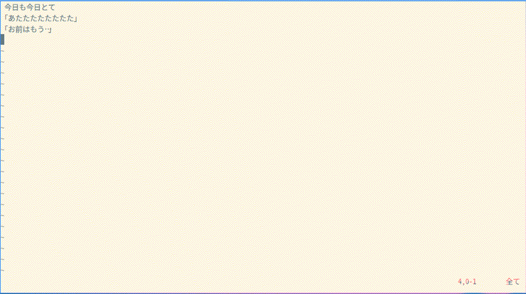

## vttな字幕ファイル編集で使ってみる

(初めてのvimでの関数作成だと思う)

## FF_Vtt_ini()

  各行を「00:00:00.000 --> 00:00:00.000」と「空白行」で挟む

  ヘッダ「WEBVTT\nKind: captions\nLanguage\n」追加
  
## FF_Vtt_add(arg_adds: any, arg_st: number)

  「arg_adds」秒を「arg_st」行以下の時間(開始と終了共に)追加
  
  「arg_adds」は「XX:XX:XX.XXX」か秒数(「3600*2」とかもあり)で指定可能
  
## FF_Vtt_adj(arg_adjs: number, arg_st: number)

  「arg_st」行以降の開始時間に「arg_adjs」秒、減じたものを
  前項目の終了時間に代入

## 以下の操作gif

・「source FF_vtt_add.vim」

・「call FF_Vtt_ini()」

※「あたた・・・」行「お前・・・」行の開始時間修正とか

・「call FF_Vtt_adj(2, 8)」

※「お前・・・」行の終了時間修正

・「call FF_Vtt_add(20, 1)」

※ 取消し (操作「call FF_Vtt_add(20, 1)」)

・「call FF_Vtt_add('1:01:20', 1)」

※行は隠れて操作…

gifファイルドラッグしたら埋め込めた、~~サイズ指定とか要らないならこれでよいかも~~

mdファイル内のリンクソース(github.com/以下略)と

実際に表示されてる画像のソースアドレス(user-images.githubusercontent.com/以下略)は違ってるみたい

日本語って難しい・・・

 (参) GithubのREADMEにGif画像を埋め込む - Qiita https://qiita.com/yamataku29/items/fb14fb99f5024e01b4b8 

``
``

どちらもいけた。アップ直後はダメだったような・・・
